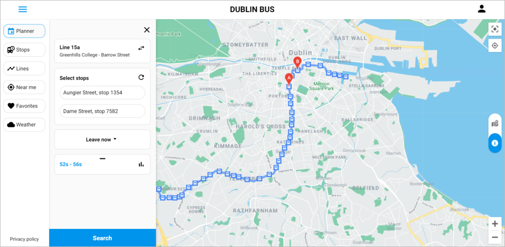
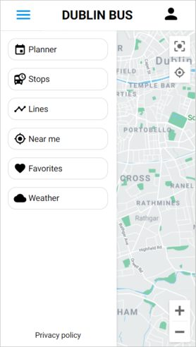

# Dublin Bus Predictions App
A web application for Dublin Bus that includes:
* More accurate dynamic travel time estimates than those provided by static timetables that can account for weather, traffic, etc.
* Estimation of uncertainty around the time estimates using [Dropout](https://arxiv.org/abs/1506.02142) in Neural Networks
* Intuitive presentation of uncertainty estimates using [Quantile Dotplots](https://dl.acm.org/doi/10.1145/2858036.2858558)
* Extensive user authentication and customisation options 

[Link](https://mystifying-swirles-3ffb35.netlify.app/) to application hosted on Netlify

## Screenshots

### Desktop view

### Mobile view

